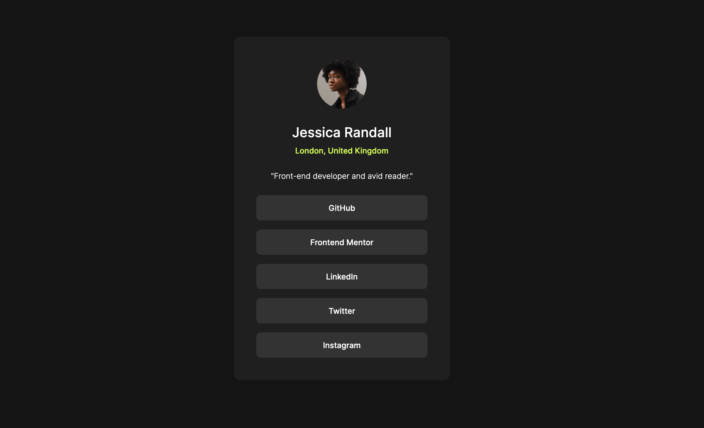

# Frontend Mentor - Social links profile solution

This is a solution to the [Social links profile challenge on Frontend Mentor](https://www.frontendmentor.io/challenges/social-links-profile-UG32l9m6dQ). Frontend Mentor challenges help you improve your coding skills by building realistic projects.

## Table of contents

- [Overview](#overview)
  - [The challenge](#the-challenge)
  - [Screenshot](#screenshot)
  - [Links](#links)
- [My process](#my-process)
  - [Built with](#built-with)
  - [What I learned](#what-i-learned)
  - [Continued development](#continued-development)
  - [Useful resources](#useful-resources)
- [Author](#author)
- [Acknowledgments](#acknowledgments)

## Overview

For this challenge, I wanted mostly to learn Tailwind CSS as well as further my learning of accessibility.

### The challenge

Users should be able to:

- See hover and focus states for all interactive elements on the page

### Screenshot



### Links

- Solution URL: [FEM Solution](https://your-solution-url.com)
- Live Site URL: [Live Site](https://sociallinksprofilefementor.netlify.app/)

## My process

- I started by copying over the starter files from the project download, as well as the design files for Figma
- I initialized git and a GitHub repo and pushed the starter files
- Initialized [Tailwind CSS](https://tailwindcss.com/)
- Styled using a mobile-first approach
- Refactored for accessibility

### Built with

- Semantic HTML5 markup
- Tailwind CSS
- Mobile-first workflow

### What I learned

- I learned how to set up a Tailwind CSS configuration, how to use the official [Tailwind VS Code extension](https://marketplace.visualstudio.com/items?itemName=bradlc.vscode-tailwindcss), which offers intellisense, and how to set up [Prettier](https://marketplace.visualstudio.com/items?itemName=esbenp.prettier-vscode) using the [prettier-plugin-tailwindcss](https://github.com/tailwindlabs/prettier-plugin-tailwindcss?tab=readme-ov-file) plugin. In the Prettier settings, I added ".prettierrc.js" to the "Prettier: Config Path," then created a file by the same name in the root of my project (also where my indec.html is), and included the following code:

```js
/** @type {import("prettier").Config} */

module.exports = {
  plugins: ["prettier-plugin-tailwindcss"],
};
```

...and now my classes format-on-save, which is rad.

- I learned that Tailwind is pretty awesome. I can definitely use it in my work flow.

- I learned that I'll have to get better with a screen reader. I think I'd really like to sit with someone who relies on methods of accessibility to browse the web.

- I learned that the "region" role is not necessary for section elements

### Continued development

I will be adopting Tailwind as my main source for styling, so I'll be diving deeper into that. I'd also like to dig deeper into how a page is broken up in terms of accessibility and how screen readers navigate through them.

I also found a section on [FreeCodeCamp](https://www.freecodecamp.org/learn/2022/responsive-web-design/#learn-accessibility-by-building-a-quiz) that focuses on accessibility. I will be working through that section.

### Useful resources

- [Tailwind Documentation](https://tailwindcss.com/docs/installation) - Very well written! Easy to navigate and understand.

## Author

- Website - [Steve Xero](https://www.stevexero.com) - under construction
- Old [Website](https://www.steven-woodward.com)
- GitHub - [Steve Xero](https://www.github.com/stevexero)
- Frontend Mentor - [@stevexero](https://www.frontendmentor.io/profile/stevexero)
- X - [@steve_xero](https://www.twitter.com/steve_xero)

## Acknowledgments

Big shouts to [Adam Wathan](https://twitter.com/adamwathan) for creating [Tailwind CSS](https://tailwindcss.com/)!
